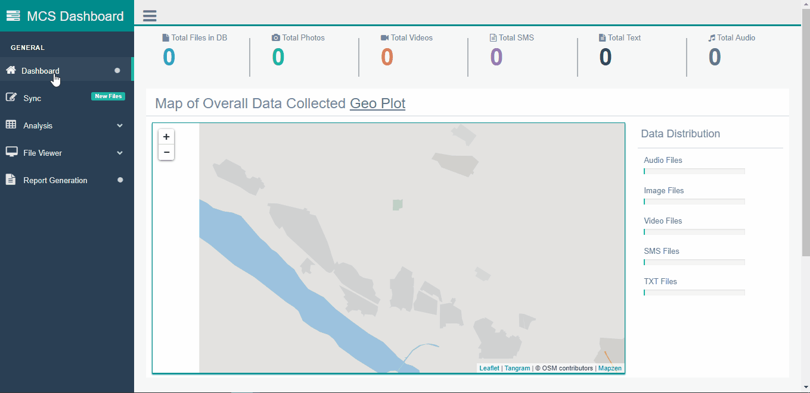

# OfflineMCS

## Installation
Python 2 only; Python 3 is not supported yet.
```
$ git clone https://github.com/ItsForkIT/offlinemcs.git
$ cd offlinemcs/
$ sudo pip install -r requirements.txt
$ python manage.py runserver 0.0.0.0:8000

```



## Setting up the Sync Folder 

```

Make a DMS/sync folder outside the offlineMCS store the file in this format 

< Type_of_Data_format >_50_< Type_of_Data >_< Phone_Number >_< Destination >_< lat >_< long >_< date_time >_50

```

## Further Configuration

1 : SYNC_URL 

`offlinemcs/offlineMCS/settings.py` set URL `SYNC_URL = os.path.abspath(BASE_DIR + "/../< sync_folder >/")`

2 : MEDIA_ROOT Folder

`offlinemcs/offlineMCS/settings.py` set folder `MEDIA_ROOT = '../< media_root_folder >/'`

3 : Map Tiles Folder

`offlinemcs/static/map/tiles` Store *.topojson tiles 
